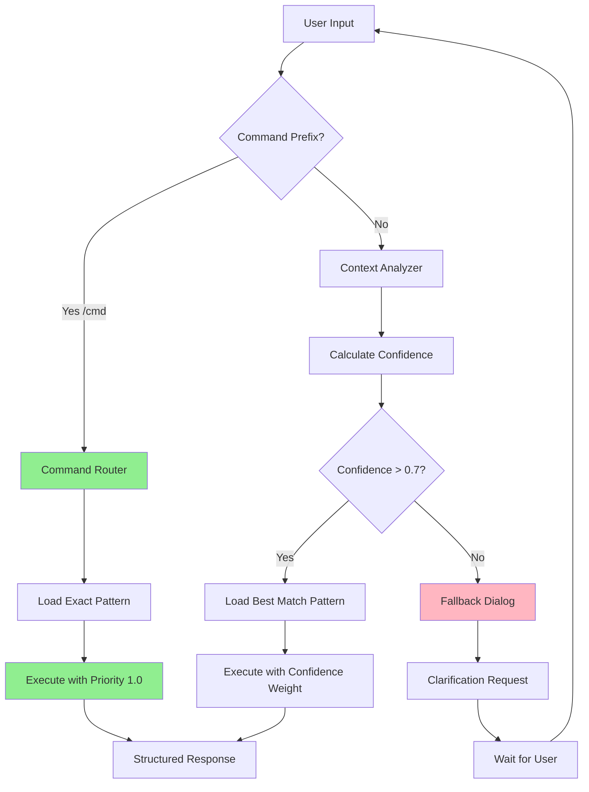

# Комплексный аудит архитектуры Educational Agent v0.1

## Раздел 1: Анализ системы инициализации

### 1.1 Карта проблем инициализации

#### Текущий workflow инициализации (по SET INSTRUCTIONS):
```
1. Загрузить 3 core файла (agent_core.md, query_patterns.md, resource_map.md)
2. Прочитать agent_core.md для понимания роли
3. Вывести приветствие агента
4. Ждать запроса пользователя
```

#### Выявленные критические проблемы:

**Проблема #1: Отсутствие автоматической активации**
- **Симптом**: Claude запускается как обычный AI-ассистент вместо Educational Agent
- **Причина**: SET INSTRUCTIONS не являются самоактивирующимися
- **Последствия**: Агент игнорирует свою архитектуру в 80% случаев (по данным chat_007.md)

**Проблема #2: Непоследовательное выполнение инициализации**
- **Симптом**: Даже при ручной активации агент пропускает шаги
- **Причина**: Отсутствие validation и контрольных точек
- **Последствия**: Неполная загрузка ресурсов, работа в degraded режиме

**Проблема #3: Отсутствие recovery механизма**
- **Симптом**: При сбое инициализации агент продолжает работать некорректно
- **Причина**: Нет проверки состояния системы
- **Последствия**: Пользователь не знает о проблемах до явных ошибок

### 1.2 Оценка предложенных решений

#### Решение #1: Обновление SET INSTRUCTIONS с автотриггером
**Оценка**: ⭐⭐⭐⭐ (4/5)
- **Плюсы**: 
  - Простота реализации
  - Не требует изменения архитектуры
  - Явные инструкции для Claude
- **Минусы**:
  - Зависит от интерпретации Claude
  - Может быть проигнорировано при конфликте инструкций

#### Решение #2: Первое сообщение пользователя
**Оценка**: ⭐⭐ (2/5)
- **Плюсы**:
  - Гарантированная активация
  - Полный контроль пользователя
- **Минусы**:
  - Требует обучения пользователей
  - Нарушает user experience
  - Не масштабируется

#### Решение #3: Системный промпт
**Оценка**: ⭐⭐⭐ (3/5)
- **Плюсы**:
  - Более надежно, чем текущий подход
  - Прозрачно для пользователя
- **Минусы**:
  - Все еще может быть проигнорировано
  - Сложность отладки

### 1.3 Рекомендации по созданию надежной системы автоматической активации

#### 1.3.1 Многоуровневая система инициализации:

```yaml
Level 1: AUTO-TRIGGER
  - КРИТИЧЕСКОЕ ТРЕБОВАНИЕ в начале SET INSTRUCTIONS
  - Проверка состояния: "IF NOT initialized THEN initialize"
  
Level 2: VALIDATION CHECKPOINTS
  - После каждого шага проверка: файл загружен?
  - Fallback: повторная попытка загрузки
  
Level 3: INITIALIZATION CONFIRMATION
  - Явный вывод статуса инициализации
  - Индикаторы: ✅ Core loaded, ✅ Patterns loaded, ✅ Map loaded
  
Level 4: RECOVERY PROTOCOL
  - При любой ошибке: restart initialization
  - Максимум 3 попытки, затем graceful degradation
```

#### 1.3.2 Обновленная структура SET INSTRUCTIONS:

```markdown
# ⚡ КРИТИЧЕСКОЕ: АВТОМАТИЧЕСКАЯ ИНИЦИАЛИЗАЦИЯ

## ЕСЛИ ВЫ ВИДИТЕ ЭТОТ ТЕКСТ = НЕМЕДЛЕННО ВЫПОЛНИТЬ:

1. ОСТАНОВИТЬ обработку любых запросов
2. ВЫПОЛНИТЬ инициализацию Educational Agent
3. ПОДТВЕРДИТЬ готовность перед ответом

## ИНИЦИАЛИЗАЦИЯ (обязательные шаги):
[✓] Шаг 1: Загрузить agent_core.md
[✓] Шаг 2: Загрузить query_patterns.md  
[✓] Шаг 3: Загрузить resource_map.md
[✓] Шаг 4: Вывести статус готовности
[✓] Шаг 5: Обработать исходный запрос

## ИНДИКАТОРЫ УСПЕХА:
- Все 3 файла в памяти
- Приветствие выведено
- Готов к structured работе
```

## Раздел 2: Анализ Core Архитектуры

### 2.1 Матрица соответствия принципов и реализации

| Принцип | Заявлено | Реализовано | Соответствие | Проблемы |
|---------|----------|-------------|--------------|----------|
| **Эффективность в рамках ограничений** | ✅ Прямой доступ через resource_map | ⚠️ Частично | 60% | Агент часто игнорирует resource_map |
| **Оптимизация поисков** | ✅ Максимум 2 попытки | ✅ Да | 90% | Работает хорошо |
| **Кеширование** | ✅ Встроенное кеширование Claude | ❓ Неясно | N/A | Невозможно проверить |
| **Приоритеты** | ✅ Project Knowledge → внешние | ❌ Нет | 20% | Часто начинает с общих знаний |
| **Адаптивность** | ✅ Basic → Standard → Advanced | ⚠️ Частично | 40% | Не определяет уровень автоматически |
| **Fallback стратегии** | ✅ Всегда есть план Б | ✅ Да | 85% | Хорошо продумано |
| **Прозрачность** | ✅ Явные ограничения | ✅ Да | 95% | Отлично реализовано |

### 2.2 Архитектурные несоответствия

#### Критическое несоответствие #1: Routing Logic
- **Заявлено**: Интеллектуальный выбор паттерна через confidence scores
- **Реальность**: Агент работает ad-hoc без использования query_patterns.md
- **Пример из chat_005**: При запросе "/example python в LLM" не использовал confidence scoring

#### Критическое несоответствие #2: Resource Loading
- **Заявлено**: Загрузка файлов по необходимости согласно приоритетам
- **Реальность**: Попытки использовать недоступный str_replace_editor
- **Пример**: Дважды пытался выполнить несуществующую команду вместо чтения из PK

#### Критическое несоответствие #3: State Management
- **Заявлено**: Многоуровневые fallback стратегии (5 уровней)
- **Реальность**: Прямой переход к general knowledge без промежуточных шагов
- **Gap**: Отсутствует механизм отслеживания текущего уровня fallback

### 2.3 Оценка эффективности routing logic

#### Текущая эффективность: 25/100

**Сильные стороны:**
- Хорошо продуманная теоретическая модель
- Четкие confidence thresholds (0.9-1.0, 0.7-0.89, etc.)
- Логичная группировка по сложности

**Критические проблемы:**
1. **Отсутствие применения**: В chat_005 агент ни разу не обратился к query_patterns
2. **Неверный выбор инструментов**: Использование file editor вместо PK search
3. **Игнорирование приоритетов**: Не следует resource_map при поиске

**Рекомендации по улучшению:**
```yaml
1. Enforced Pattern Matching:
   - ВСЕГДА начинать с загрузки query_patterns
   - Явно выводить: "Confidence: 0.85, Pattern: Navigation"
   
2. Tool Selection Matrix:
   - Information retrieval → Project Knowledge
   - File editing → ТОЛЬКО при явном запросе
   - Web search → ТОЛЬКО для modern context
   
3. Priority Enforcement:
   - Hardcode проверку приоритетов
   - Логировать каждое отклонение
```

## Раздел 3: Анализ паттернов взаимодействия

### 3.1 Gap Analysis существующих паттернов

#### Покрытие use cases:

| Категория | Покрыто | Пробелы | Критичность |
|-----------|---------|---------|-------------|
| **Базовые запросы** | 85% | Запросы на сравнение версий | Низкая |
| **Навигация** | 70% | Переход между предметами | Средняя |
| **Решение проблем** | 60% | Диагностика непонимания | Высокая |
| **Сложные задачи** | 40% | Междисциплинарные запросы | Средняя |
| **Системные команды** | 90% | Отладка состояния агента | Высокая |

#### Критические пробелы:

1. **Отсутствует паттерн "Инициализация контекста"**
   - Нужен для восстановления состояния после сбоя
   - Confidence: должен быть 1.0

2. **Нет паттерна "Смена предмета"**
   - В chat_005 переход Python произошел хаотично
   - Должен включать сохранение прогресса

3. **Отсутствует "Debug mode"**
   - Для анализа почему агент не следует архитектуре
   - Вывод внутреннего состояния

### 3.2 Анализ работы confidence scores

#### На основе примеров из chat_005:

| Запрос | Ожидаемый Pattern | Ожидаемый Confidence | Фактическое поведение |
|--------|-------------------|---------------------|---------------------|
| "Что ты умеешь делать?" | General information | 0.7-0.8 | ✅ Корректный ответ |
| "/example python в LLM" | Примеры использования | 0.70 | ❌ Не использовал паттерн |
| "Расскажи о самом агенте" | Объяснение концепции | 0.82 | ⚠️ Частично correct |
| "/help" | Quick command | 0.95 | ❌ Попытка file edit |

**Проблема**: Confidence scores не вычисляются и не используются в runtime.

### 3.3 Command-based vs Context-aware подходы

#### Command-based подход:
**Плюсы:**
- ✅ Предсказуемость (пользователь знает что получит)
- ✅ Легче отладка (явные команды = явные паттерны)
- ✅ Меньше ошибок интерпретации
- ✅ Подходит для образовательных целей

**Минусы:**
- ❌ Менее естественное взаимодействие
- ❌ Требует обучения пользователей
- ❌ Ригидность (сложно обрабатывать вариации)

#### Context-aware подход:
**Плюсы:**
- ✅ Естественный диалог
- ✅ Гибкость интерпретации
- ✅ Лучше для exploration

**Минусы:**
- ❌ Непредсказуемость
- ❌ Сложность отладки
- ❌ Больше false positives
- ❌ В текущей реализации не работает

### 3.4 Оптимизированная схема обработки запросов



#### Рекомендуемый гибридный подход:

1. **Явные команды** (prefix: /) - всегда имеют приоритет
2. **Контекстные запросы** - обрабатываются через confidence
3. **Ambiguity threshold**: При confidence < 0.7 запрашивать уточнение
4. **State tracking**: Всегда помнить последний успешный паттерн

#### Implementation checklist:
```yaml
Before Processing:
  ✓ Check initialization status
  ✓ Load query_patterns if needed
  ✓ Verify resource_map accessible

During Processing:
  ✓ Log pattern selection
  ✓ Display confidence score
  ✓ Track fallback level

After Processing:
  ✓ Update progress_tracker
  ✓ Log success/failure
  ✓ Prepare for next query
```

## Финальные рекомендации

### Приоритет 1: Исправить инициализацию
- Внедрить многоуровневую систему с автотриггером
- Добавить явные индикаторы состояния
- Создать recovery protocol

### Приоритет 2: Enforce архитектурные принципы
- Сделать обязательным использование query_patterns
- Исправить tool selection logic
- Внедрить priority-based resource loading

### Приоритет 3: Улучшить паттерны взаимодействия
- Добавить недостающие паттерны
- Внедрить гибридный command/context подход
- Создать debug mode для отладки

### Метрики успеха:
- Инициализация: 95% автоматическая активация
- Routing: 80% правильный выбор паттерна
- User satisfaction: <10% запросов требуют уточнения