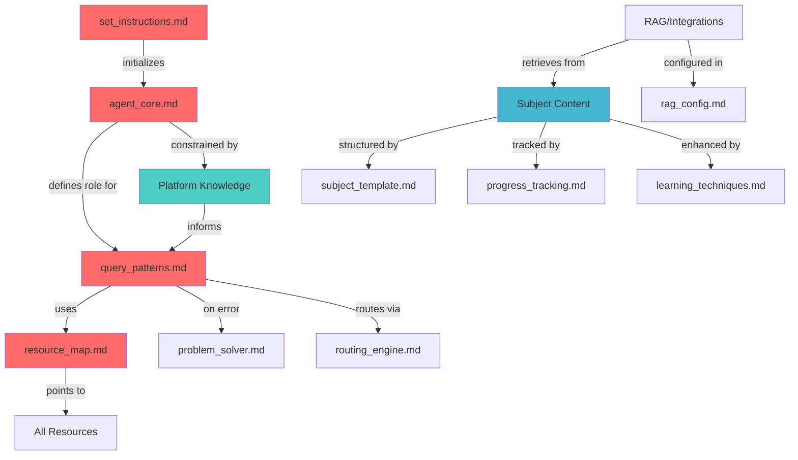

# Аудит и оптимизация файловой структуры Educational Agent

## 1. Обновленная матрица приоритетов

### 1.1 Пересмотр приоритетов с учетом всех анализов

| Приоритет | Категория | Файлы | Обоснование | ERT |
|-----------|-----------|-------|-------------|-----|
| **P0** | Initialization | `set_instructions.md` | Без него агент не активируется (критическая проблема из анализов) | ⚡ |
| **P1** | Core Engine | `agent_core.md`, `query_patterns.md`, `resource_map.md` | Основа функционирования | ⚡ |
| **P2** | Runtime Systems | `problem_solver.md`, `subject_modules.md` | Обработка запросов и fallback | 🚀 |
| **P3** | Platform Knowledge | `claude_capabilities.md`, `context_management.md`, `tools_usage.md` | Понимание возможностей и ограничений | 🚀 |
| **P4** | Subject Content | Учебные материалы, файлы предметов | Основной контент для обучения | 🔄 |
| **P5** | Enhancement | `prompting_guide.md`, интеграции, аналитика | Улучшения и оптимизации | 🐌 |

### 1.2 Обоснование изменений приоритетов

**Новый P0 - Initialization:**
- Анализы показали, что отсутствие автоматической инициализации - блокер №1
- `set_instructions.md` должен быть отдельным приоритетом

**P3 - Platform Knowledge повышен:**
- Агент не понимает свои возможности без этих файлов
- Критично для правильного выбора инструментов

**P5 - Разделение enhancement:**
- `prompting_guide.md` менее критичен, чем считалось ранее
- Перемещен в enhancement вместе с будущими интеграциями

## 2. Оптимизированная файловая структура

### 2.1 Предлагаемая новая структура

```
educational-agent/
│
├── _init/                          # P0: Критичная инициализация
│   └── set_instructions.md         # Автозапуск агента
│
├── core/                           # P1: Ядро системы
│   ├── agent_core.md              # Роль и принципы
│   ├── query_patterns.md          # Паттерны обработки
│   └── resource_map.md            # Навигация по ресурсам
│
├── runtime/                        # P2: Системы времени выполнения
│   ├── problem_solver.md          # Обработка ошибок
│   └── routing_engine.md          # Маршрутизация запросов (новый)
│
├── platform/                       # P3: Знания о платформе
│   ├── capabilities/
│   │   ├── claude_limits.md      # Ограничения Claude
│   │   ├── context_window.md     # Управление контекстом
│   │   └── tools_reference.md    # Доступные инструменты
│   └── optimization/
│       ├── file_formats.md        # Оптимальные форматы
│       └── performance_tips.md    # Советы по производительности
│
├── knowledge/                      # P4: База знаний
│   ├── subjects/                  # Предметные области
│   │   ├── _template/            # Шаблон для новых предметов
│   │   │   └── subject_template.md
│   │   ├── mathematics/
│   │   │   ├── algebra.md       # Единый файл предмета
│   │   │   └── resources/       # Дополнительные материалы
│   │   ├── programming/
│   │   │   ├── python.md
│   │   │   └── resources/
│   │   └── ml/
│   │       ├── machine_learning.md
│   │       └── resources/
│   │
│   ├── shared/                    # Общие ресурсы для всех предметов
│   │   ├── learning_techniques.md
│   │   ├── assessment_patterns.md
│   │   └── progress_tracking.md   # Единый для всех предметов
│   │
│   └── integrations/              # Внешние интеграции
│       ├── rag_config.md         # Настройки RAG
│       └── mcp_setup.md          # Model Context Protocol
│
├── enhancements/                   # P5: Улучшения
│   ├── prompting_guide.md        # Руководство по промптам
│   ├── advanced_features.md      # Продвинутые возможности
│   └── future_roadmap.md         # Планы развития
│
├── _meta/                          # Метаинформация
│   ├── README.md                  # Описание проекта
│   ├── CHANGELOG.md              # История изменений
│   └── CONTRIBUTING.md           # Руководство для контрибьюторов
│
└── developer/                      # Файлы разработчика (вне агента)
    ├── research/
    ├── analysis/
    └── archive/
```

### 2.2 Ключевые изменения и их обоснование

#### 1. **Введение `_init/` директории**
- **Причина**: Критическая проблема с инициализацией требует явного выделения
- **Преимущество**: Невозможно пропустить при загрузке

#### 2. **Разделение `core/` и `runtime/`**
- **Причина**: Четкое разделение статических правил и динамических систем
- **Преимущество**: Легче понять, что загружается при старте vs что работает во время выполнения

#### 3. **Новая директория `platform/`**
- **Причина**: Агент должен понимать свои возможности (выявлено в анализах)
- **Преимущество**: Централизованное место для всех знаний о Claude

#### 4. **Унификация структуры предметов**
- **Причина**: Текущая структура с 5 файлами на предмет избыточна
- **Преимущество**: Один основной файл + опциональные ресурсы

#### 5. **Введение `shared/` для общих ресурсов**
- **Причина**: Избежать дублирования progress_tracker и modern_context
- **Преимущество**: Single source of truth для общих функций

## 3. Схема зависимостей компонентов

### 3.1 Граф зависимостей



### 3.2 Матрица зависимостей

| Компонент | Зависит от | Используется в | Критичность |
|-----------|------------|----------------|-------------|
| `set_instructions` | - | Запуск системы | Блокер |
| `agent_core` | `set_instructions` | Все компоненты | Критично |
| `query_patterns` | `agent_core`, `platform/*` | Обработка запросов | Критично |
| `resource_map` | `query_patterns` | Навигация | Критично |
| `problem_solver` | `query_patterns` | Error handling | Важно |
| `platform/*` | - | `query_patterns`, `agent_core` | Важно |
| `subjects/*` | `subject_template` | Обучение | Стандарт |
| `progress_tracking` | `subjects/*` | Отслеживание | Стандарт |

### 3.3 Порядок загрузки компонентов

```yaml
boot_sequence:
  1_critical:
    - _init/set_instructions.md      # Автозапуск
    
  2_core:
    - core/agent_core.md             # Роль и правила
    - core/query_patterns.md         # Паттерны
    - core/resource_map.md           # Карта ресурсов
    
  3_runtime:
    - runtime/problem_solver.md      # Обработка ошибок
    - runtime/routing_engine.md      # Маршрутизация
    
  4_knowledge:
    - platform/capabilities/*        # Возможности Claude
    - knowledge/shared/*             # Общие ресурсы
    
  5_on_demand:
    - knowledge/subjects/*           # По запросу
    - knowledge/integrations/*       # При необходимости
    - enhancements/*                 # Опционально
```

## 4. Миграционный план

### 4.1 Этапы миграции

#### Phase 1: Критические изменения (День 1)
1. Создать `_init/` и переместить `set_instructions.md`
2. Обновить `set_instructions.md` с автотриггером
3. Обновить `resource_map.md` с новыми путями

#### Phase 2: Структурные изменения (День 2-3)
1. Создать новые директории
2. Переместить файлы согласно новой структуре
3. Объединить файлы предметов в единые модули

#### Phase 3: Добавление новых компонентов (День 4-5)
1. Создать файлы platform knowledge
2. Добавить `routing_engine.md`
3. Создать shared ресурсы

### 4.2 Обратная совместимость

```yaml
compatibility_aliases:
  # Старый путь -> Новый путь
  "/system/progress_tracker.md": "/knowledge/shared/progress_tracking.md"
  "/subjects/python/python_reference.md": "/knowledge/subjects/programming/python.md#reference"
  "/system/modern_context.md": "/knowledge/subjects/[subject]/[subject].md#modern-context"
```

## 5. Метрики успеха реорганизации

### 5.1 Количественные метрики

| Метрика | Текущее | Целевое | Улучшение |
|---------|---------|---------|-----------|
| Файлов на предмет | 5 | 1-2 | -60% |
| Уровней вложенности | 3 | 3 | 0% |
| Дублирование кода | ~30% | <5% | -25% |
| Время добавления предмета | 3-4 часа | 1-2 часа | -50% |
| Время инициализации | Неопределенно | <2 сек | ✓ |

### 5.2 Качественные улучшения

1. **Ясность структуры**: Каждая директория имеет четкое назначение
2. **Масштабируемость**: Легко добавлять новые предметы и функции
3. **Поддерживаемость**: Меньше файлов, яснее зависимости
4. **Производительность**: Оптимизированный порядок загрузки
5. **Надежность**: Решена проблема с инициализацией