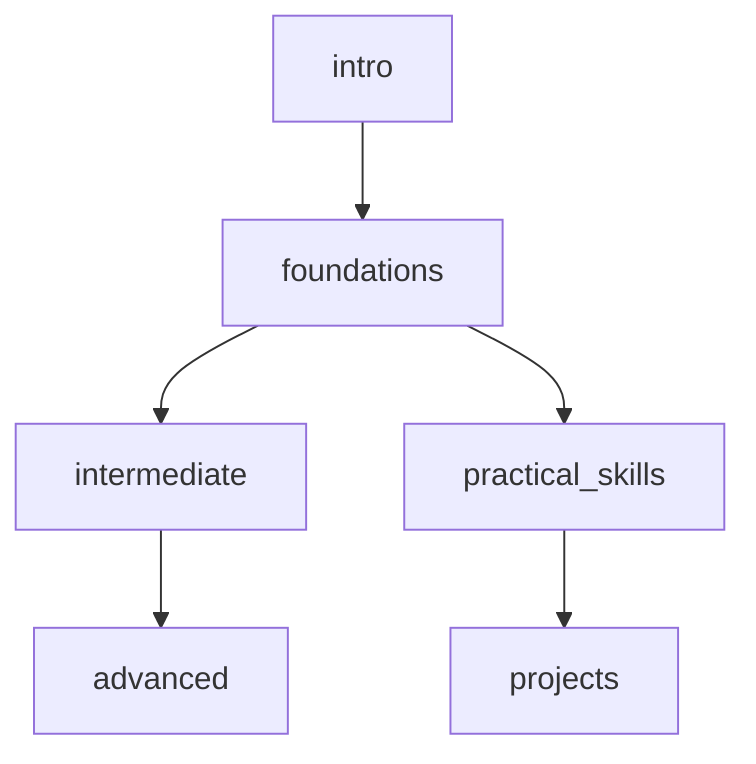

# Архитектура модульной системы знаний для Educational Agent

## 1. Универсальный шаблон предметного модуля

### 1.1 Единый файл vs Множественные файлы

После анализа текущей структуры с тремя файлами (_dependencies, _reference, _study_guide) предлагаю **гибридный подход**:

- **Один основной файл** `[subject].md` - содержит 80% необходимой информации
- **Опциональные расширения** для сложных предметов

Это решение обеспечивает:
- ✅ Быстрый старт (один файл)
- ✅ Масштабируемость (можно расширять)
- ✅ Простоту поддержки

### 1.2 Универсальный шаблон предметного модуля

```markdown
# [SUBJECT_NAME] - ОБРАЗОВАТЕЛЬНЫЙ МОДУЛЬ

---
## 📋 МЕТАДАННЫЕ МОДУЛЯ

```yaml
module:
  name: "[Subject Name]"
  version: "1.0.0"
  language: "ru"
  difficulty_range: "[BASIC|STANDARD|ADVANCED]"
  estimated_hours: 
    basic: 40
    standard: 120
    advanced: 300+
  prerequisites: ["module1", "module2"] # или [] если нет
  
metadata:
  created: "2024-01-01"
  updated: "2024-01-01"
  authors: ["Author Name"]
  tags: ["tag1", "tag2", "tag3"]
  
integration:
  depends_on: ["agent_core", "query_patterns"]
  updates: ["при добавлении новых тем"]
  used_by: ["progress_tracker", "resource_map"]
  priority: "[HIGH|MEDIUM|LOW]"
```

---

## 🎯 ОБЗОР ПРЕДМЕТА

### Описание
[2-3 предложения о предмете, его важности и применении]

### Ключевые цели изучения
- Цель 1: [конкретная, измеримая цель]
- Цель 2: [конкретная, измеримая цель]
- Цель 3: [конкретная, измеримая цель]

### Практические применения
- В профессии: [примеры]
- В жизни: [примеры]
- В других областях: [связи с другими предметами]

---

## 📚 СТРУКТУРА КОНТЕНТА

### Модульная организация
```yaml
modules:
  - id: "intro"
    title: "Введение в [предмет]"
    topics: 3
    hours: 5
    difficulty: "BASIC"
    
  - id: "foundations"
    title: "Основы [предмета]"
    topics: 8
    hours: 20
    difficulty: "BASIC"
    
  - id: "intermediate"
    title: "Углубленное изучение"
    topics: 12
    hours: 40
    difficulty: "STANDARD"
    
  - id: "advanced"
    title: "Продвинутые темы"
    topics: 10
    hours: 60
    difficulty: "ADVANCED"
```

### Карта зависимостей


---

## 🔤 АДАПТИВНЫЙ СЛОВАРЬ

### Уровень: BASIC
```yaml
термин1:
  simple: "простое объяснение для начинающих"
  example: "бытовой пример"
  
термин2:
  simple: "объяснение простыми словами"
  example: "наглядный пример"
```

### Уровень: STANDARD
```yaml
термин1:
  standard: "более точное определение с деталями"
  context: "контекст использования"
  
термин2:
  standard: "формальное определение"
  context: "профессиональный контекст"
```

### Уровень: ADVANCED
```yaml
термин1:
  advanced: "полное академическое определение"
  formal: "математическая/формальная нотация"
  nuances: "тонкости и исключения"
```

---

## 🎓 МЕТОДОЛОГИЯ ОБУЧЕНИЯ

### Адаптация под стили обучения
```yaml
learning_adaptations:
  visual:
    - "Использовать диаграммы для [тема]"
    - "Mind maps для связей между [концепции]"
    - "Цветовое кодирование для [категории]"
    
  verbal:
    - "Детальные текстовые объяснения"
    - "Пошаговые инструкции"
    - "Аналогии и метафоры"
    
  practical:
    - "Hands-on упражнения"
    - "Реальные кейсы"
    - "Проектная работа"
```

### Типовые проблемы и решения
```yaml
common_difficulties:
  - problem: "[Частая проблема 1]"
    symptoms: ["симптом1", "симптом2"]
    solution: "Рекомендуемый подход"
    
  - problem: "[Частая проблема 2]"
    symptoms: ["симптом1", "симптом2"]
    solution: "Альтернативный метод"
```

---

## 🛠️ ИНСТРУМЕНТЫ И РЕСУРСЫ

### Рекомендуемые инструменты
```yaml
tools:
  essential:
    - name: "[Tool 1]"
      purpose: "Для чего используется"
      level: "BASIC"
      
  recommended:
    - name: "[Tool 2]"
      purpose: "Дополнительные возможности"
      level: "STANDARD"
      
  advanced:
    - name: "[Tool 3]"
      purpose: "Профессиональное использование"
      level: "ADVANCED"
```

### Внешние ресурсы
```yaml
resources:
  books:
    - title: "[Название]"
      author: "[Автор]"
      level: "BASIC"
      why: "Почему рекомендуется"
      
  online:
    - name: "[Ресурс]"
      url: "[URL]"
      type: "course|video|interactive"
      level: "STANDARD"
      
  practice:
    - platform: "[Платформа]"
      focus: "Что тренирует"
      level: "ALL"
```

---

## 📊 ОЦЕНКА ПРОГРЕССА

### Контрольные точки
```yaml
checkpoints:
  - id: "basics_complete"
    criteria:
      - "Понимает ключевые термины"
      - "Решает простые задачи"
      - "Может объяснить основы"
    assessment: "[Метод проверки]"
    
  - id: "intermediate_ready"
    criteria:
      - "Применяет знания на практике"
      - "Видит связи между концепциями"
      - "Решает задачи средней сложности"
    assessment: "[Метод проверки]"
```

### Метрики успеха
```yaml
success_metrics:
  knowledge:
    - metric: "Понимание концепций"
      target: "80%"
      measurement: "Тесты/объяснения"
      
  skills:
    - metric: "Практическое применение"
      target: "70%"
      measurement: "Проекты/задачи"
      
  retention:
    - metric: "Долгосрочное запоминание"
      target: "60%"
      measurement: "Повторные проверки"
```

---

## 🔗 ИНТЕГРАЦИЯ С СИСТЕМОЙ

### Связи с другими модулями
```yaml
connections:
  requires:
    - module: "[prerequisite_module]"
      topics: ["topic1", "topic2"]
      reason: "Почему необходимо"
      
  enhances:
    - module: "[related_module]"
      synergy: "Как дополняют друг друга"
      
  leads_to:
    - module: "[advanced_module]"
      pathway: "Путь развития"
```

### Команды и паттерны
```yaml
specific_commands:
  - command: "/practice [topic]"
    description: "Генерирует практические задания"
    
  - command: "/explain [concept] --level=[BASIC|STANDARD|ADVANCED]"
    description: "Адаптивное объяснение"
    
  - command: "/roadmap"
    description: "Показывает путь обучения"
```

---

## 🚀 QUICK START

### Минимальный путь для начала
1. **Шаг 1**: [Конкретное действие] (5 минут)
2. **Шаг 2**: [Следующее действие] (10 минут)
3. **Шаг 3**: [Первое достижение] (15 минут)

### Первая неделя
- День 1-2: [Темы]
- День 3-4: [Темы]
- День 5-7: [Практика и закрепление]

---
*Этот модуль — часть Educational Agent системы. Версия: [version]*
```

## 2. Минимальная жизнеспособная структура (MVS)

### 2.1 Обязательные секции для запуска

Для быстрого добавления нового предмета достаточно заполнить:

```markdown
# [SUBJECT] - MINIMAL MODULE

## 📋 МЕТАДАННЫЕ (обязательно)
```yaml
module:
  name: "[Subject]"
  version: "0.1.0"
  difficulty_range: "BASIC"
  estimated_hours: {basic: 20}
  prerequisites: []
```

## 🎯 ОБЗОР (обязательно)
- Что это за предмет
- Зачем изучать
- Что сможете после изучения

## 📚 КОНТЕНТ (обязательно)
### Темы:
1. Тема 1 (2 часа)
2. Тема 2 (3 часа)
3. Тема 3 (3 часа)
[минимум 5 тем]

## 🔤 СЛОВАРЬ (обязательно)
- Термин 1: простое определение
- Термин 2: простое определение
[минимум 10 терминов]

## 🛠️ ИНСТРУМЕНТЫ (обязательно)
- Что понадобится для изучения
- Где практиковаться
```

### 2.2 Критерии готовности модуля

| Уровень | Требования | Время создания |
|---------|------------|----------------|
| **Minimal (MVS)** | 5 разделов, 10 терминов, 5 тем | 1-2 часа |
| **Standard** | Полный шаблон, 20+ терминов, dependencies | 4-6 часов |
| **Complete** | + примеры, + упражнения, + ресурсы | 8-12 часов |

## 3. Руководство для администраторов

### 3.1 Пошаговый процесс добавления предмета

#### Шаг 1: Решение о добавлении
```yaml
Checklist:
  ✓ Есть спрос от пользователей?
  ✓ Есть эксперт в предметной области?
  ✓ Определен target audience?
  ✓ Ясны learning outcomes?
```

#### Шаг 2: Создание MVS
1. Скопировать minimal template
2. Заполнить обязательные секции
3. Протестировать с 2-3 пользователями
4. Получить feedback

#### Шаг 3: Расширение до Standard
1. Добавить полный словарь (3 уровня)
2. Создать карту зависимостей
3. Добавить методологию обучения
4. Интегрировать с progress_tracker

#### Шаг 4: Интеграция в систему
```bash
# Структура файлов
/subjects/
  /[subject_name]/
    [subject_name].md          # Основной файл
    [subject_name]_exercises.md # Опционально
    [subject_name]_projects.md  # Опционально
    /resources/                 # Дополнительные материалы
```

### 3.2 Контрольный список качества

#### Обязательные проверки:
- [ ] Метаданные корректны и полны
- [ ] Есть хотя бы 10 ключевых терминов
- [ ] Определены prerequisites (или явно указано [])
- [ ] Время изучения реалистично
- [ ] Есть практические применения

#### Качественные проверки:
- [ ] Язык адаптирован под целевую аудиторию
- [ ] Примеры релевантны и понятны
- [ ] Структура логична и последовательна
- [ ] Нет противоречий с другими модулями

### 3.3 Автоматизация процесса

#### CLI команда для создания модуля:
```bash
educational-agent create-module \
  --name "History" \
  --level "BASIC" \
  --hours 40 \
  --prerequisites "none" \
  --template "standard"
```

#### Валидация модуля:
```python
def validate_module(module_path):
    """Проверяет соответствие модуля стандартам"""
    checks = {
        'has_metadata': check_yaml_section('metadata'),
        'has_overview': check_section('ОБЗОР'),
        'min_topics': count_topics() >= 5,
        'min_terms': count_terms() >= 10,
        'valid_difficulty': check_difficulty_range(),
        'has_resources': check_section('ИНСТРУМЕНТЫ')
    }
    return all(checks.values()), checks
```

### 3.4 Maintenance и обновления

#### Регулярные обновления (ежемесячно):
- Проверка актуальности ссылок
- Обновление modern context
- Добавление новых примеров

#### Major обновления (ежеквартально):
- Ревизия структуры курса
- Анализ feedback пользователей
- Обновление зависимостей

#### Version control:
```yaml
versioning:
  patch: "Исправления, уточнения" # 1.0.x
  minor: "Новые темы, ресурсы"    # 1.x.0
  major: "Изменение структуры"    # x.0.0
```

## 4. Масштабируемость системы

### 4.1 Оценка масштабируемости

| Аспект | Оценка | Обоснование |
|--------|--------|-------------|
| **Добавление предметов** | ⭐⭐⭐⭐⭐ | Шаблонная структура, MVS за 2 часа |
| **Поддержка** | ⭐⭐⭐⭐ | YAML метаданные, версионирование |
| **Интеграция** | ⭐⭐⭐⭐ | Стандартные интерфейсы |
| **Локализация** | ⭐⭐⭐ | Нужна отдельная структура для языков |

### 4.2 Потенциал роста

С текущей архитектурой система может поддерживать:
- **50-100 предметов** без изменения архитектуры
- **5-10 языков** с минимальными доработками
- **1000+ пользователей** одновременно (ограничения Claude)

### 4.3 Рекомендации по оптимизации

1. **Создать Module Registry**:
   ```yaml
   registry:
     mathematics:
       algebra: "v2.1.0"
       geometry: "v1.5.0"
     sciences:
       physics: "v1.0.0"
       chemistry: "v0.9.0"
   ```

2. **Автоматическая генерация resource_map**:
   - Сканировать все модули
   - Строить граф зависимостей
   - Обновлять при изменениях

3. **Модульное тестирование**:
   - Проверка внутренней консистентности
   - Валидация cross-references
   - Проверка покрытия тем