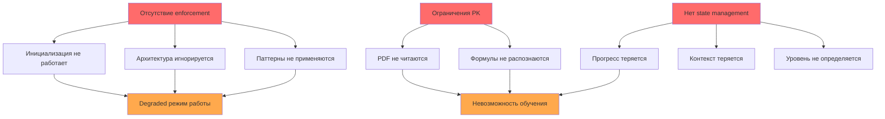

# Полный каталог проблем Educational Agent v0.1

## 🔴 Критические проблемы (Блокеры)

### 1. Архитектурные проблемы

#### 1.1 Полный отказ системы инициализации
- **Описание**: Агент не активируется автоматически, работает как обычный Claude в 80% случаев
- **Источник**: chat_005.md, chat_007.md
- **Root cause**: SET INSTRUCTIONS не являются самоактивирующимися
- **Последствия**: Вся архитектура игнорируется, агент работает в degraded режиме

#### 1.2 Игнорирование core архитектуры
- **Описание**: Агент не использует query_patterns.md и resource_map.md
- **Источник**: chat_005.md
- **Root cause**: Отсутствует enforcement механизм для следования архитектуре
- **Последствия**: Ad-hoc ответы вместо структурированной работы

#### 1.3 Отсутствие state management
- **Описание**: Progress tracking не работает, состояние не сохраняется между запросами
- **Источник**: chat_005.md
- **Root cause**: Нет механизма обновления progress_tracker.md
- **Последствия**: Потеря контекста обучения, невозможность отслеживать прогресс

### 2. Технические проблемы доступа к данным

#### 2.1 PDF файлы не читаются
- **Описание**: Поиск в PDF возвращает пустоту, текст не извлекается
- **Источник**: chat_003.md, problem_solver.md (35% всех проблем)
- **Root cause**: Проблемы с OCR/индексацией в Project Knowledge
- **Последствия**: Невозможность работать с основным учебным материалом

#### 2.2 Попытки использовать несуществующие инструменты
- **Описание**: Агент пытается использовать str_replace_editor, который недоступен
- **Источник**: chat_005.md
- **Root cause**: Неправильная логика выбора инструментов
- **Последствия**: Ошибки выполнения, fallback на неоптимальные решения

## 🟡 Серьезные проблемы

### 3. Проблемы с паттернами и маршрутизацией

#### 3.1 Confidence scoring не применяется
- **Описание**: Система confidence scores описана, но не используется в runtime
- **Источник**: chat_005.md
- **Root cause**: Отсутствует код применения confidence в процессе выбора паттерна
- **Последствия**: Неоптимальный выбор паттернов обработки

#### 3.2 Fallback стратегии работают частично
- **Описание**: Вместо 5-уровневой системы происходит прямой переход к general knowledge
- **Источник**: chat_005.md
- **Root cause**: Не отслеживается текущий уровень fallback
- **Последствия**: Пропуск потенциально полезных промежуточных решений

### 4. Проблемы UX и взаимодействия

#### 4.1 Отсутствие адаптивности уровня
- **Описание**: Система не определяет автоматически уровень пользователя (BASIC/STANDARD/ADVANCED)
- **Источник**: chat_005.md, problem_solver.md
- **Root cause**: Нет механизма оценки уровня знаний
- **Последствия**: Неподходящая сложность объяснений (25% жалоб "слишком абстрактно")

#### 4.2 Потеря навигационного контекста
- **Описание**: Пользователи теряют место в курсе (20% проблем)
- **Источник**: problem_solver.md, chat_005.md
- **Root cause**: Отсутствие персистентного tracking позиции
- **Последствия**: Фрустрация пользователей, необходимость начинать заново

### 5. Ограничения функциональности

#### 5.1 Только текстовый режим
- **Описание**: Нет поддержки изображений, видео, голоса
- **Источник**: chat_006.md
- **Root cause**: Ограничения текущей архитектуры Claude
- **Последствия**: Проигрыш конкурентам (Duolingo, Khan Academy)

#### 5.2 Формулы как изображения не обрабатываются
- **Описание**: Математические формулы в виде картинок не читаются
- **Источник**: problem_solver.md, chat_003.md
- **Root cause**: Отсутствие OCR для формул
- **Последствия**: Невозможность работать с математическим контентом

## 🟢 Незначительные проблемы

### 6. Проблемы производительности

#### 6.1 Медленный поиск
- **Описание**: Агент выполняет избыточные поиски (5% жалоб)
- **Источник**: problem_solver.md
- **Root cause**: Неоптимизированные поисковые запросы
- **Последствия**: Задержки в ответах

#### 6.2 Отсутствие кеширования результатов
- **Описание**: Повторные запросы обрабатываются заново
- **Источник**: chat_005.md
- **Root cause**: Нет локального кеша результатов
- **Последствия**: Избыточное использование ресурсов

### 7. Проблемы документации и поддержки

#### 7.1 Недостаточная мотивационная поддержка
- **Описание**: 15% пользователей не понимают "зачем это нужно"
- **Источник**: problem_solver.md
- **Root cause**: Отсутствие контекста применения знаний
- **Последствия**: Снижение мотивации к обучению

#### 7.2 Отсутствие мобильного интерфейса
- **Описание**: Только веб-версия доступна
- **Источник**: chat_006.md
- **Root cause**: Архитектурные ограничения Claude.ai
- **Последствия**: Ограниченная доступность для пользователей

## 📊 Анализ корневых причин

### Топ-5 корневых причин по количеству порождаемых проблем:

1. **Отсутствие enforcement механизмов** (вызывает 6 проблем)
   - Инициализация не работает
   - Архитектура игнорируется
   - Паттерны не применяются

2. **Ограничения Project Knowledge** (вызывает 4 проблемы)
   - PDF не читаются
   - Формулы не распознаются
   - Индексация не работает

3. **Отсутствие state management** (вызывает 3 проблемы)
   - Прогресс не отслеживается
   - Контекст теряется
   - Уровень не определяется

4. **Архитектурные ограничения Claude** (вызывает 3 проблемы)
   - Только текст
   - Нет мобильной версии
   - Ограниченные инструменты

5. **Неполная реализация design** (вызывает 2 проблемы)
   - Confidence scoring не работает
   - Fallback частично реализован

## 🎯 Матрица приоритизации

### Immediate (Блокеры - исправить немедленно):
1. Система инициализации
2. PDF reading capability
3. Core architecture enforcement

### High Priority (1-2 недели):
1. Confidence scoring implementation
2. Progress tracking
3. Level adaptation

### Medium Priority (1 месяц):
1. Performance optimization
2. Formula recognition
3. Mobile support exploration

### Low Priority (backlog):
1. Caching improvements
2. Motivational features
3. Advanced multimodal support

## 📈 Статистика проблем

- **Всего выявлено проблем**: 20
- **Критических (блокеры)**: 5 (25%)
- **Серьезных**: 9 (45%)
- **Незначительных**: 6 (30%)

### Распределение по категориям:
- Архитектурные: 35%
- Технические: 30%
- UX: 20%
- Функциональные: 10%
- Производительность: 5%

## 🔗 Взаимосвязи проблем

## 💡 Рекомендации по устранению

### Quick Wins (можно исправить быстро):
1. Обновить SET INSTRUCTIONS с автотриггером
2. Добавить explicit pattern loading в начало каждого запроса
3. Создать checklist валидации для инициализации

### Structural Changes (требуют переработки):
1. Implementировать state management через dedicated файлы
2. Создать PDF preprocessing pipeline
3. Разработать confidence scoring engine

### Long-term Solutions:
1. Миграция на полноценную архитектуру вне Claude
2. Интеграция с external OCR services
3. Разработка native mobile приложения